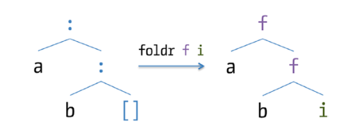

# Chapter 3 - Increasing Code Reuse

## Parametric Polymorphism

- Note the type of the `head` function:

    ```haskell
    > :t head
    head :: [a] -> a
    ```

- The `a` here is a _type variable_ that can be bound to different types
  depending on use:

    ```haskell
    > :set -XTypeApplications
    > :t head @Int
    head @Int :: [Int] -> Int

    > :t head "Hello"
    head "Hello" :: Char
    ```

- Functions like `head` are said to work for any value of the type parameter
  `a`.  This is referred to as _parametric polymorphism_ (c.f. C++ _templates_
  and Java _generics_).

- Polymorphism is available in both functions and data types, e.g.:

    ```haskell
    data Triple a b c = Triple a b c

    > :t Triple 42 "foo" True
    Triple 42 "foo" True :: Num a => Triple a [Char] Bool
    ```


## Functions as Parameters

### Higher-order Functions

- Consider using the function `map` to add 1 to all members of the list `[1, 2,
  3]`:

    ```haskell
    > succ 1
    2
    > map succ [1, 2, 3]
    [2,3,4]

    > :t map
    map :: (a -> b) -> [a] -> [b]
    ```

- The first parameter to `map` is itself a function, of type `a -> b`.
  Functions like this, that take other functions as parameters, are called
  _higher-order functions_.

- A commonly-used higher-order function is `$` (function application):

    ```haskell
    ($) :: (a -> b) -> a -> b
    f $ a = f a
    ```

- `$` is useful because it has very low operator precedence.  Therefore both
  sides of `$` will be evaluated before `f` is applied to `a`:

    ```haskell
    > maximum (map succ [1, 2, 3])
    4

    -- is the same as
    > maximum $ map succ [1, 2, 3]
    4
    ```


### Anonymous Functions

- _Anonymous functions_ have the form `\param1 param2 ... -> body`:

    ```haskell
    > map (\x -> x + 2) [1, 2, 3]
    [3,4,5]
    ```

- Certain types of pattern matching can occur on paramteres in anonymous
  functions just like other functions:

    ```haskell
    equalTuples :: [(Integer, Integer)] -> Bool
    equalTuples t = map (\(x, y) -> x == y) t
    ```

- By enabling the `LambdaCase` extension, we can use the special `\case` syntax
  to create an anonymous function with only one parameter to match on:

    ```haskell
    sayHello names = map (\case "Martin" -> "Hello there me!"
                                name     -> "Welcome, " ++ name
                         ) names
    ```


### Partial Application

- Consider a function to doulbe all elements in a list:

    ```haskell
    double list = map (\x -> x * 2) list

    -- or
    double = \list -> map (\x -> x * 2) list
    ```

- This can also be written as `double = map (\x -> x * 2)`, using _partial
  application_.

- We can also write `\x -> x * 2` using a _section_ as `(*2)`, so `double = map
  (*2)`.

- Partial application encourages a _point-free_ style of programming, where
  functions are combined without mentioning parameters.  Key to this is the
  _function composition_ operator `(.)`:

    ```haskell
    (.) :: (b -> c) -> (a -> b) -> a -> c
    f . g = \x -> f (g x)
    ```

- Using `.`, we can often rewrite functions, e.g."

    ```haskell
    doubleOdds list = map (*2) $ filter odd list

    -- can be written in point-free style as
    doubleOdds = map (*2) . filter odd
    ```

- The next two _combinators_ (functions that combine other functions) are used
  to convert multi-argument functions to single-argument functions that take
  tuples:

    ```haskell
    uncurry :: (a -> b -> c) -> (a, b) -> c
    uncurry f = \(x, y) -> f x y

    curry :: ((a, b) -> c) -> a -> b -> c
    curry f = \x y -> f (x, y)

    -- This is the _curried_ version of `max`
    > max 3 2
    3

    -- and the uncurried version
    > (uncurry max) (3, 2)
    3
    ```

- The `flip` combinator reverses the order of parameters in a function:

    ```haskell
    flip :: (a -> b -> c) -> (b -> a -> c)
    flip f = \x y -> f y z
    ```


## More about Modules

### Module imports

- Module imports allow definitions from one module to be used in another.

- The most basic way to import a module brings into scope all the definitions
  and makes them available for use as if they were declared in the importing
  module:

    ```haskell
    module PracticalHaskell.Chapter03.MoreModules where

    import Data.List

    permutationsStartingWith :: Char -> String -> [String]
    permutationsStartingWith letter
        = filter (\l -> head l == letter) . permutations
    ```

- To prevent name clashes, we can selectively import only certain definitions:

    ```haskell
    module PracticalHaskell.Chapter03.MoreModules where

    import Data.List (permutations, subsequence)

    -- remaining definitions unchanged
    ```

- Or we can import everything except specified definitions:

    ```haskell
    module PracticalHaskell.Chapter03.MoreModules where

    import Data.List hiding (head, tail)

    -- remaining definitions unchanged
    ```

- ADTs have two pieces of information, the type and its constructors, so imports
  are specified using `Type(ListOfConstructors)`:

    ```haskell
    module PracticalHaskell.Chapter03.MoreModules where

    import DataTypes (Client())                   -- only type, no constructors
    import DataTypes (Client(GovOrg, Individual)) -- only specified constructors
    import DataTypes (Client(..))                 -- all constructors
    ```

- _Qualified imports_ require prefixing the function with its full module name
  when used:

    ```haskell
    module PracticalHaskell.Chapter03.MoreModules where

    import qualified Data.List (filter, permutations)

    permutationsStartingWith :: Char -> String -> [String]
    permutationsStartingWith letter
        = Data.List.filter (\l -> head l == letter) . Data.List.permutations
    ```

- With qualified imports, the package name can be shortened:

    ```haskell
    module PracticalHaskell.Chapter03.MoreModules where

    import qualified Data.List as L

    permutationsStartingWith :: Char -> String -> [String]
    permutationsStartingWith letter
        = L.filter (\l -> head l == letter) . L.permutations
    ```


### Smart Constructors & Views

- As well as controlling which othe rmodules to _import_, it's possible to
  control which declarations in the current module are _exported_, by adding the
  export list as part of the `module` declaration:

    ```haskell
    module M (f) where

    f = ...
    g = ...
    ```

- With data types, there are several options for exporting, as for importing:
    - Just the type, not the constructor - thereby disallowing creation of
      values using the constructor.
    - The type and some subset of constructors.
    - The type and all its constructors.

- When discussing the [_default values
  idiom_](../chapter02/README.md#the-default-values-idiom) previously, there was
  no way to restrict the creation of `ConnOptions` values using the constructor.
  Now we can export only the datatype:

    ```haskell
    module PracticalHaskell.Chapter02.Records (ConnOptinos(), connDefault) where

    -- Remaining declarations unchanged
    ```

- This introduces the idea of _smart constructors_.  Consider a `Range` type
  representing a closed integer range between `a` and `b`, with the invariant `a
  <= b`:

    ```haskell
    data Range = Range Integer Integer deriving Show
    ```

- This won't prevent us creating invalid ranges:

    ```haskell
    > Range 10 5
    Range 10 5
    ```

- As an alternative, we create a _smart constructor_ function `range` that
  performs the check:

    ```haskell
    range :: Integer -> Integer -> Range
    range a b = if a <= b
                   then Range a b
                   else error "a must be <= b"

    > range 5 10
    Range 5 10

    > range 10 5
    *** Exception: a must be <= b
    ```

- Then we just export the `Range` type without constructors, and the smart
  constructor:

    ```haskell
    module PracticalHaskell.Chapter03.Ranges (Range(), range) where

    -- Remaining definitions
    ```

- However, code in other modules that attempts to pattern match on the `Range`
  constructor won't compile:

    ```haskell
    module PracticalHaskell.Chapter03.RangesClient where

    import PracticalHaskell.Chapter03.Ranges

    -- This function won't compile because `Range` is inaccessible
    -- prettyRange :: Range -> String
    -- prettyRange (Range a b) = "[" ++ show a ++ ", " ++ show b ++ "]"
    ```

- The solution is to create a new data type encoding the observed values of that
  type and use views when pattern matching:

    ```haskell
    module PracticalHaskell.Chapter03.Ranges
        (Range(), range, RangeObs(..), r) where

    -- Other definitions for `Range` and `range` unchanged

    data RangeObs = R Integer Integer deriving Show

    -- This will be used in the view pattern
    r :: Range -> RangeObs
    r (Range a b) = R a b
    ```

    ```haskell
    {-# LANGUAGE ViewPatterns #-}

    module PracticalHaskell.Chapter03.RangesClient where

    import PracticalHaskell.Chapter03.Ranges

    prettyRange :: Range -> String
    prettyRange rng = case rng of
                           (r -> R a b) -> "[" ++ show a ++ ", " ++ show b ++ "]"
    ```

- We can use a _pattern synonym_ to encapsulate this packaging and unpackaging
  of `Range` values so that our consumer doesn't need to be aware of its
  implementation:

    ```haskell
    {-# LANGUAGE PatternSynonyms #-}

    module PracticalHaskell.Chapter03.RangesSynonyms
        (Range(), range, pattern R) where

    -- Other definitions for `Range` and `range` unchanged

    pattern R :: Integer -> Integer -> Range
    pattern R a b <- Range a b
      where R a b = range a b
    ```

    ```haskell
    module PracticalHaskell.Chapter03.RangesSynonymsClient where

    import PracticalHaskell.Chapter03.RangesSynonyms

    prettyRange :: Range -> String
    prettyRange (R a b) = "[" ++ show a ++ ", " ++ show b ++ "]"
    ```


## Diving into Lists

### Folds

- A _fold_ over a data structure like a list is a function that aggregates the
  values in that structure to produce a single result (e.g. summing all integers
  in a list):

    ```haskell
    foldr :: (a -> b -> b) -> [a] -> b
    foldr _ initial []     = initial
    foldr f initial (x:xs) = f x (foldr f initial xs)
    ```

- Here's the process of evaluating `foldr (+) 0 [1, 2, 3]`:

    ```haskell
    foldr (+) 0 [1, 2, 3] = 1 + foldr (+) 0 [2, 3]
                          = 1 + (2 + foldr (+) [3])
                          = 1 + (2 + (3 + foldr (+) 0 []))
                          = 1 + (2 + (3 + 0))
                          = 1 + (2 + 3)
                          = 1 + 5
                          = 6
    ```

- `foldr` traverses the list element-by-element until it reaches the end.  It
  then uses the `initial` value to start evaluating the call stack that's been
  created, using the combining function (e.g. `(+)`).

- Here's a useful way to visualise the operation of `foldr` graphically:



- Note that `foldr` _associates to the right_ - the innermost parentheses in the
  earlier expansion are to the right.  The alternative function `foldl`
  associates to the left:

    ```haskell
    foldl :: (a -> b -> a) -> a -> [b] -> a
    foldl _ initial []     = initial
    foldl f initial (x:xs) = foldl f (f initial x) xs
    ```

- Now here's the process of evaluating `foldl (+) 0 [1, 2, 3]`:

    ```haskell
    foldl (+) 0 [1, 2, 3] = foldl (+)   (0 + 1)           [2, 3]
                          = foldl (+)  ((0 + 1) + 2)      [3]
                          = foldl (+) (((0 + 1) + 2) + 3) []
                          =           (((0 + 1) + 2) + 3)
                          =           ((      1 + 2) + 3)
                          =                       3  + 3
                          =                            6
    ```

- The results of `foldr` and `foldl` are the same if the combining function is
  commutative.  However:

    ```haskell
    > foldr (-) 0 [1, 2, 3]
    2

    > foldr (-) 0 [1, 2, 3]
    -6
    ```


### Lists & Predicates

- A _predicate_ is a function with type `a -> Bool`, which can be used to test
  whether a value meets a certain condition - e.g. filtering a list to only keep
  values satisfying the predicate, using `filter`.

- `Data.List.partition` splits the list into elements satisfying the predicate
  and those that don't:

    ```haskell
    > import Data.List
    > partition (> 0) [1, 2, -3, 4, -5, -6]
    ([1,2,4],[-3,-5,-6])
    ```

- `Data.List.find` returns the first value satisfying the predicate, wrapped
  inside a `Maybe`, because one may not exist:

    ```haskell
    > find (> 0) [1, 2, -3, 4, -5, -6]
    Just 1

    > find (> 7) [1, 2, -3, 4, -5, -6]
    Nothing
    ```

- `Data.List.dropWhile` returns the list from the point at which the predicate
  becomes false:

    ```haskell
    > dropWhile (< 0) [-2, -1, 0, 1, 2]
    [0,1,2]

    > dropWhile (< 0) [1, -2, -1, 0, 1, 2]
    [1,-2,-1,0,1,2]
    ```

- Similarly, `takeWhile` takes the initial elements until the predicate becomes
  false:

    ```haskell
    > takeWhile (< 0) [-2, -1, 0, 1, 2]
    [-2,-1]

    > takeWhile (< 0) [-1, 1, -2, 2]
    [-1]
    ```

- `takeWhile` and `dropWhile` are components of `span`, which returns a tuple of
  the taken and dropped list:

    ```haskell
    > span (< 0) [-2, -1, 0, 1, 2]
    ([-2,-1],[0,1,2])
    ```

- `break` does the same as `span` but negates the predicate (i.e. `break = span
  (not . p)`:

    ```haskell
    > span (>= 0) [-2, -1, 0, 1, 2]
    ([-2,-1],[0,1,2])
    ```

- `any` and `all` check whether at least one / all members of the list
  satisfy the predicate:

    ```haskell
    > any (> 0) [-1, 1]
    True

    > all (> 0) [-1, 1]
    False
    ```

- `nubBy` takes a binary predicate (`a -> a -> Bool`) that defines an
  _equivalence_ and a list and removes elements that are considered equivalent
  according to the predicate:

    ```haskell
    > nubBy (\x y -> mod x 3 == mod y 3) [1,2,4,5,6]
    [1,2,6]
    ```

- Using `(==)` as the predicate means removing duplicates from the list.  This
  is also the default behaviour of `nub`:

    ```haskell
    > nubBy (==) [1, 2, 1, 1, 3, 2, 4, 1]
    [1, 2, 3, 4]

    > nub [1, 2, 1, 1, 3, 2, 4, 1]
    [1, 2, 3, 4]
    ```

- *Note:* Both `nub` and `nubBy` have quadratic performance because they need to
  check equivalence / equality for all pairs of elements.

- Set operations `union(By)`, `intersect(By)` and `\\` (set difference) all
  operate as expected:

    ```haskell
    > [1, 2, 3] `union` [3, 4, 5]
    [1,2,3,4,5]

    > [1, 2, 3] `intersect` [3, 4, 5]
    [3]

    > [1, 2, 3] \\ [2, 3]
    [1]
    ```

- `elem` just tells you whether an element is a member of a list:

    ```haskell
    > 2 `elem` [1, 2, 3]
    True

    > 4 `elem` [1, 2, 3]
    False
    ```

- Binary predicates are also used for ordering - `p x y` means that in some way
  `x` precedes `y`.  Defined by an `Ordering` value - either `LT`, `EQ` or `GT`.
  Here's an example of ordering for `Client`s:

    ```haskell
    compareClient :: Client a -> Client a -> Ordering
    compareClient (Individual{person = p1}) (Individual{person = p2})
                                    = compare (firstName p1) (firstName p2)
    compareClient (Individual {}) _ = GT
    compareClient _ (Individual {}) = LT
    compareClient c1 c2             = compare (clientName c1) (clientName c2)
    ```

- Now we can sort clients:

    ```haskell
    > import Data.List
    > sortBy compareClient listOfClients
    ...
    ```

- Some types (e.g. numbers) come with a default sort order, so we can use
  `sort`:

    ```haskell
    > sort [1, 4, 2, -3]
    [-3,1,2,4]
    ```

- We can group elements of a list based on a characteristic using `groupBy`.


### Lists of Tuples

- Some functions work on or produce lists of tuples (i.e. of type `[(a, b)]`:

    ```haskell
    > zip [1, 2, 3] "abc"
    [(1,'a'),(2,'b'),(3,'c')]

    -- `unzip` is the reverse of `zip`:
    > unzip [(1,'a'),(2,'b'),(3,'c')]
    ([1, 2, 3], "abc")
    ```

- We can model a rudimentary _association list_ (a.k.a. _dictionary_ or _map_)
  as a list of tuples containing key-value pairs.  We can then use `lookup` to
  look up values by key:

    ```haskell
    > let capitals = [("France","Paris"),("Spain","Madrid"), ("Portugal","Lisbon")]
    > lookup "Spain" capitals
    Just "Madrid"

    > lookup "UK" capitals
    Nothing
    ```


### List Comprehensions

- _List comprehensions_ are similar to the mathematical expression of set
  notation, e.g.:

    ```haskell
    duplicateOdds lists = [ 2 * x | x <- list, odd x ]
    ```

- List comprehensions have the following parts:
    - _expression_ - the part before the `|`
    - _generators_ - of the form `e <- list`, which determine the source of the
      elements in the epxression.  Note that the `e` part can be a pattern, and
      only values that match the pattern will be included.
    - _bindings_ - of the form `let b = expression`.
    - _guards_ - predicates that determine which elements are included.

- List comprehensions can have multiple generators, and generators may also
  depend on elements from another generator:

    ```haskell
    > [(x, y, x*y) | x <- [1 .. 4], y <- [1 .. 10]]
    [(1,1,1), (1,2,2), (1,3,3) ... ]

    > [(x, y) | x <- [0 .. 6], y <- [x .. 6]]
    [(0,0), (0,1), ... (5,5), (5,6), (6,6)]
    ```

- Example of bindings:

    ```haskell
    > [ sqrt v | (x,y) <- [(1,2),(3,8)], let v = x*x+y*y ]
    [2.23606797749979,8.54400374531753]
    ```

- The `TransformListComp` extension provides additional qualifiers for list
  comprehensions, e.g.:
    - `then` - transforms the input list by applying a function
    - `then f by e` - transforms the list - e.g. `then sortWith by x`
    - `then group by e using f` - applies grouping - e.g. `then group by p using
      groupWith`

- The `ParallelListComp` extension enables multiple qualifier branches, which
  are traversed in parallel:

    ```haskell
    > [ x*y | x <- [1, 2, 3], y <- [1, 2, 3] ]
    [1,2,3,2,4,6,3,6,9]

    > [ x*y | x <- [1, 2, 3] | y <- [1, 2, 3] ]
    [1,4,9]
    ```


## Haskell Origami

- Folds are very powerful - almost all list functions can be written using
  `foldr`, e.g.:

    ```haskell
    filterAsFold :: (a -> Bool) -> [a] -> [a]
    filterAsFold p = foldr (\x l -> if p x then x : l else l) []

    mapAsFold :: (a -> b) -> [a] -> [b]
    mapAsFold f = foldr (\x l -> f x : l) []
    ```

- The dual of _folds_ are _unfolds_, which create lists out of seed values:

    ```haskell
    > import Data.List
    > :t unfoldr
    unfoldr :: (b -> Maybe (a, b)) -> b -> [a]
    ```

- The algorithm is:
    - Start with a seed of type `b`
    - Apply the function `b -> Maybe (a, b)`
    - `Nothing` signals the `unfoldr` should stop producing elements
    - `Just (x, s)` attaches `x` to the new list and continues with `s` as the
      new seed.

- Example of generating a list from `n` to `m`:

    ```haskell
    enumUnfold :: Int -> Int -> [Int]
    enumUnfold n m = unfoldr (\x -> if x > m then Nothing else Just (x, x+1)) n
    ```
